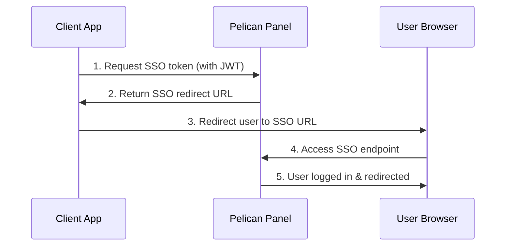

# Pelican SSO

> ⚠️ **Work in Progress:** This package is currently under development and is not production-ready yet.

**Pelican SSO** is a secure Single Sign-On (SSO) package for [Pelican Panel](https://github.com/pelican-dev/panel/) that enables seamless user authentication across multiple applications. Using JWT (JSON Web Tokens) with EdDSA signatures, it provides a modern and secure way to authorize users on your Pelican Panel instance from external websites.

## Features

- 🔐 **Secure JWT-based authentication** with EdDSA signatures
- 🚀 **Easy integration** with most Laravel-based applications (not tested)
- 🌐 **Cross-domain support** for distributed applications
- 🛡️ **Built-in security** with token expiration and validation
- 📱 **Framework agnostic** client implementation (works with any language)

## WIP Features

- [ ] 🔑 **JWKS support** for public key distribution
- [ ] 🔧 **Different algorithm support** beyond EdDSA

## Installation

### Via Composer (Recommended)

1. **Add the repository** to your `composer.json`:
```bash
composer config repositories.sso-pelican vcs https://github.com/tobi1craft/sso-pelican.git
```

2. **Install the package**:
```bash
composer require tobi1craft/sso-pelican:dev-main
```

3. **Publish the configuration**:
```bash
&& php artisan vendor:publish --tag=sso
```

4. **Configure**:
   - Change the published configuration file at `config/sso.php` or set these environment variables:

```env
SSO_ISSUER: "https://your-app.example.com"
SSO_AUDIENCE: "https://pelican.example.com" # Can be left empty to use the default Pelican Panel URL (APP_URL)
SSO_PUBLIC_KEY_ENDPOINT: "https://your-app.example.com/api/pelican-token"
```


5. **Optimize** (optional but recommended):
```bash
composer dump-autoload --optimize
php artisan route:cache
php artisan view:cache
php artisan event:cache
```

<details>
<summary>Example using Docker for Pelican Panel</summary>

```Dockerfile
# change version here:
FROM ghcr.io/pelican-dev/panel:latest

USER root

# Install system dependencies
RUN apk add --no-cache curl git unzip

# Install Composer
RUN curl -sS https://getcomposer.org/installer \
    | php -- --install-dir=/usr/local/bin --filename=composer

WORKDIR /var/www/html

# Install Pelican SSO package
RUN composer config repositories.sso-pelican vcs https://github.com/tobi1craft/sso-pelican.git \
    && composer require tobi1craft/sso-pelican:dev-main \
    && php artisan vendor:publish --tag=sso \
    && composer dump-autoload --optimize \
    && php artisan route:cache \
    && php artisan view:cache \
    && php artisan event:cache

USER www-data
```
</details>

## Configuration

1. Generate a new SSO key (random string, at least **32** characters).
2. Set the key as an environment variable: `SSO_SECRET`.

## How It Works

The SSO flow consists of three main steps:

1. **Token Request**: Your application requests an access token from the Pelican Panel
2. **User Redirect**: The user is redirected to the SSO endpoint with the token
3. **Authentication**: The user is automatically logged into Pelican Panel



## Usage

### Step 1: Generate and Sign JWT

Create a JWT with the required payload and sign it with your EdDSA private key.

### Step 2: Request SSO Token

Send a GET request to `/request-sso` with the signed JWT in the Authorization header.

### Step 3: Redirect User

Redirect the user to the returned SSO URL.

---

## Code Examples

<details>
<summary><strong>PHP Example</strong> (using Laravel HTTP client)</summary>

```php
$payload = [
    'iss' => 'https://your-app.example.com',
    'aud' => 'https://pelican.example.com',
    'iat' => time(),
    'exp' => time() + 60,
    'sub' => 'sso',
    'user' => 1,
];

// Create JWS token (EdDSA signed)
// Normally use a JWT library of your choice to build and sign the JWT:
$jws = 'HEADER.' . base64_encode(json_encode($payload)) . '.SIGNATURE';

$response = Http::withToken($jws)->get('https://pelican.example.com/request-sso');

if (!$response->successful()) {
    $message = $response->json('message', 'SSO request failed. Please contact an admin.');
    return redirect()->back()->withError($message);
}

// Redirect user to Pelican Panel SSO endpoint
return redirect($response->json('redirect'));
```

</details>

<details>
<summary><strong>TypeScript/JavaScript Example</strong> (using JOSE library)</summary>

```typescript
import { SignJWT } from "jose";

const privateKey = /* your EdDSA private key here */;

// Create and sign the JWT
const jws = await new SignJWT({ user: 1 })
  .setProtectedHeader({ alg: "EdDSA" })
  .setSubject("sso")
  .setIssuedAt()
  .setIssuer("https://your-app.example.com")
  .setAudience("https://pelican.example.com")
  .setExpirationTime("1m")
  .sign(privateKey);

// Request SSO token from Pelican Panel
const response = await fetch("https://pelican.example.com/request-sso", {
  method: "GET",
  headers: {
    Authorization: `Bearer ${jws}`,
  },
});

const pelicanResponse = (await response.json()) as { message?: string; redirect?: string };

if (!response.ok) {
  throw new Error(pelicanResponse.message ?? "Something went wrong, please contact an administrator.");
}

// Redirect the user to the Pelican Panel SSO endpoint
window.location.href = pelicanResponse.redirect ?? "/";
```

</details>

---

## API Endpoints

This package adds the following routes to your Pelican Panel:

| Method | Endpoint | Description |
|--------|----------|-------------|
| `GET` | `/request-sso` | Request SSO authentication (requires JWT) |
| `GET` | `/sso/{token}` | Complete SSO login process |

## JWT Payload Requirements

Your JWT must include the following claims:

| Claim | Type | Required | Description |
|-------|------|----------|-------------|
| `iss` | string | ✅ | Issuer (your application URL) |
| `aud` | string | ✅ | Audience (Pelican Panel URL) |
| `iat` | number | ✅ | Issued at timestamp |
| `exp` | number | ✅ | Expiration timestamp |
| `sub` | string | ✅ | Subject (must be "sso") |
| `user` | number | ✅ | Pelican Panel user ID |

## Security Considerations

- ✅ **JWT Expiration**: Tokens should have short expiration times (recommended: 1-5 minutes)
- ✅ **HTTPS Only**: Always use HTTPS in production
- ✅ **Key Management**: Store private keys securely and rotate them regularly
- ✅ **Validation**: All JWT claims are validated server-side
- ✅ **EdDSA Signatures**: Modern cryptographic signatures for enhanced security

## Troubleshooting

### Common Issues

**"Invalid JWT signature"**
- Verify your private key is correct and in the right format
- Ensure the algorithm is set to "EdDSA"
- Check that your public key is properly configured

**"User not found"**
- Verify the user ID exists in your Pelican Panel database
- Check that the user account is active

**"Invalid issuer/audience"**
- Verify your `iss` claim matches your configured issuer
- Ensure `aud` claim matches your Pelican Panel URL

### Debug Mode

Enable debug logging in your Pelican Panel's Environment Variables:

```env
APP_DEBUG=true
```

## Support

If you have any questions or issues, please create a new issue in the project repository on GitHub.

## Contributing

Just clone and install everything using composer. Optionally leave out PHP-Extensions that are not installed.

```bash
composer install --ignore-platform-req=ext-intl --ignore-platform-req=ext-zip --ignore-platform-req=ext-bcmath
```

## License

This project is licensed under the [MIT License](LICENSE) - see the LICENSE file for details.

## Acknowledgments

- [Pelican Panel](https://github.com/pelican-dev/panel/) for the amazing game server management platform
- [web-token/jwt-library](https://github.com/web-token/jwt-library) for secure JWT implementation

---

<div align="center">
  Made with ❤️ by <a href="https://github.com/tobi1craft">tobi1craft</a>
</div>
